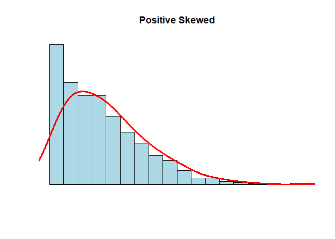

Atividade Avaliativa I
================
Ícaro Vidal Freire </br>
Estat 2021.1

-----

**Questão 01** jhçkjbnkj

**(a)**

**(b)**

**Questão 05** Rodando o seguinte código:

``` r
N <- 1000
x <- rnbinom(N, 4, .5)
hist(
x,
xlim = c(min(x), max(x)),
probability = T,
nclass = max(x) - min(x) + 1,
col = 'lightblue', xlab = ' ', ylab = ' ', axes = F,
main = 'Positive Skewed'
)
lines(density(x, bw = 1), col = 'red', lwd = 3)
```

<!-- -->

Observando o gráfico uma escolha adequada para uma medida resumo, dentre
as opções dadas, seria a …; pois, …
